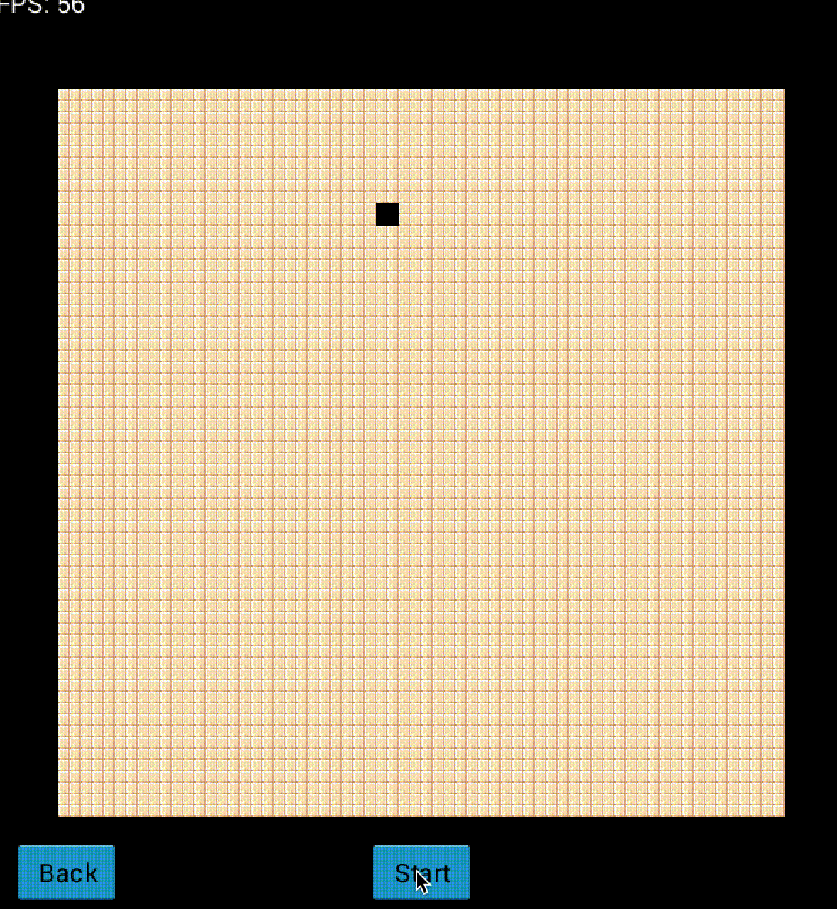
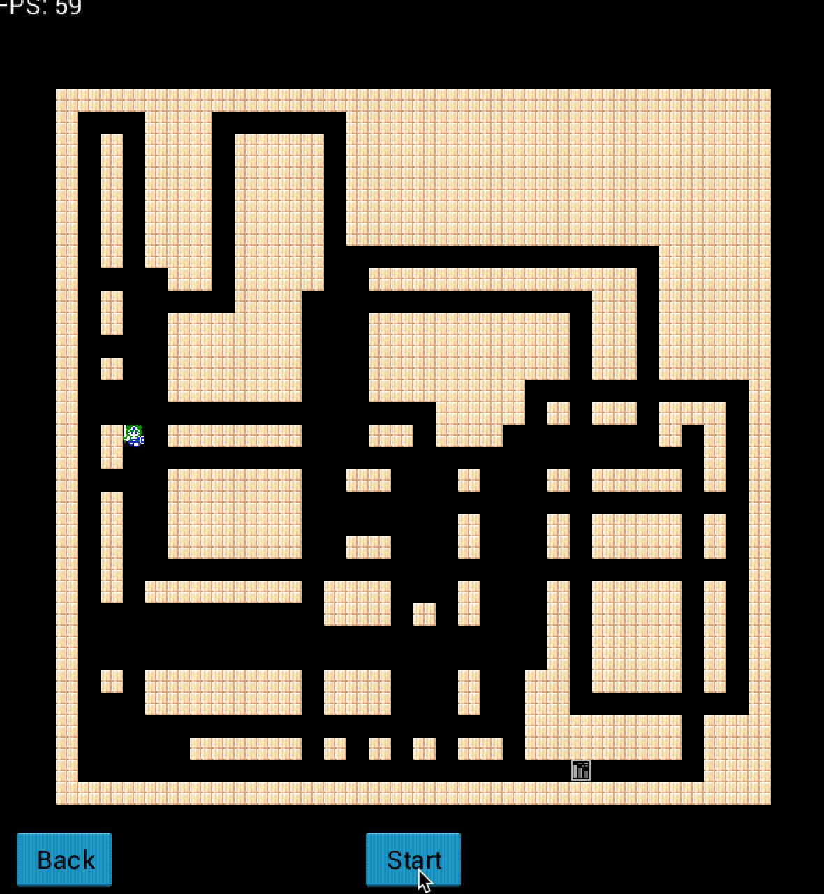
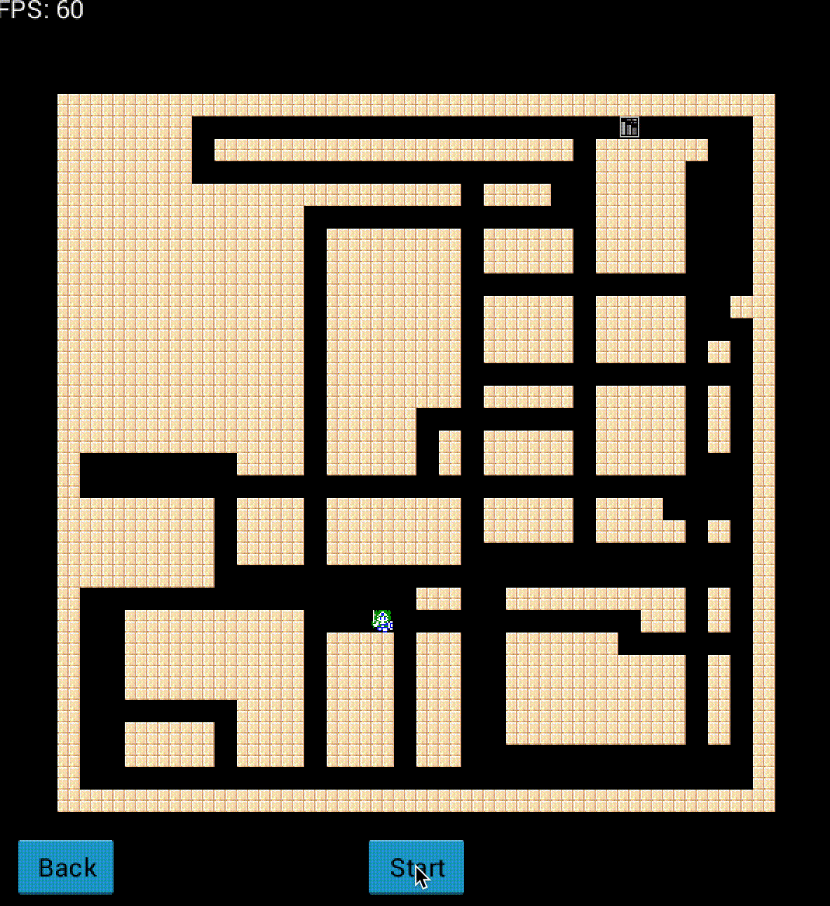

# MapGenerator-GDX
Demo
----
<table>
  <tr>
    <th>Map Generator</th>
    <th>Depth-First Search</th>
    <th>Breadth-First Search</th>
  </tr>
  <tr>
    <td></td>
    <td></td>
    <td></td>
  </tr>
</table>

Thanks to
---------
* [Daniel](https://github.com/nooone) for [Android Holo Theme](https://github.com/nooone/gdx-holo)
* [Realm of Darkness.net](http://www.realmofdarkness.net/dq/) for Dragon Quest sprites
* [The Spriters Resource](https://www.spriters-resource.com/) for the sprites
